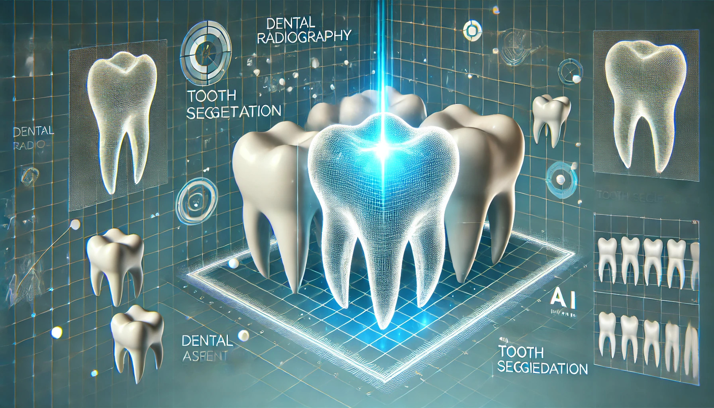

# Dental Radiography Image Segmentation

This repository contains the code and steps for preprocessing, segmenting, and post-processing dental radiography images to create a dataset of segmented teeth.



## Table of Contents

1. [Introduction](#introduction)
2. [Preprocessing](#preprocessing)
3. [Segmentation](#segmentation)
4. [Post-Processing](#post-processing)
5. [Usage](#usage)
6. [Acknowledgments](#acknowledgments)

## Introduction

This project involves the segmentation of dental radiography images to extract individual teeth. The goal is to create a new dataset consisting of individual teeth images from the original radiographs. The process includes image preprocessing, segmentation using the Segment Anything Model (SAM), and post-processing to refine the segmented images.

## Preprocessing

Before applying segmentation, the images undergo a preprocessing step to enhance their quality. The preprocessing involves selecting the green channel of the image, dilating the mask, thresholding, and applying CLAHE (Contrast Limited Adaptive Histogram Equalization).

## Segmentation

The segmentation step leverages the **Segment Anything Model (SAM)** to isolate and extract individual teeth from the radiographs. This section includes functions to load images and annotations, segment injured teeth, save segmented parts, segment normal teeth, black out injured areas, and remove images below a certain pixel threshold.

1. 	`def load_image_and_annotations(image_path, annotation_csv)`: Load an image and its corresponding annotations from a CSV file.


2.	`def segment_injured_tooth(image, bbox, predictor)`: Segment an injured tooth based on the bounding box using the SAM predictor.


3.	`def save_segmented_part(image, mask, label, output_folder, part_index, filename)`: Save the segmented part of the image using the provided mask.


4.	`def segment_normal_teeth(image, annotations, mask_generator, normal_folder, filename)`: Segment normal teeth in the image by generating masks that do not overlap with injured areas.


5.	`def black_out_injured_areas(image, annotations)`: Black out areas of the image corresponding to injured teeth based on annotations.


6.	`def remove_images_below_threshold(folder_path, threshold)`: Remove images from the folder if the percentage of non-zero pixels is below the threshold.


7.	`def process_folder(folder_path, annotation_csv, predictor, mask_generator, base_path)`: Process a folder of images by segmenting injured and normal teeth, and saving the results.


## Post-Processing

After segmentation, the original images are removed, and the segmented images are cropped and resized to a standard size. The processed images are then zipped for easier distribution and storage.


## Usage

1. **Preprocess the Images**
   ```python
   preprocess_images(main_directory, target_directory)
   ```

2. **Segment the Images**
   ```python
   # Ensure the segment-anything dependencies are installed and models downloaded
   !pip install git+https://github.com/facebookresearch/segment-anything.git
   !pip install opencv-python pycocotools matplotlib onnxruntime onnx tqdm
   !wget https://dl.fbaipublicfiles.com/segment_anything/sam_vit_h_4b8939.pth

   # Run the segmentation process
   for folder in folders:
       folder_path = os.path.join(base_path, folder)
       annotation_csv = annotation_files[folder]
       process_folder(folder_path, annotation_csv, predictor, mask_generator, base_path)
   ```

3. **Remove Original Images**
   ```python
   remove_original_images(base_path, folders)
   ```

4. **Crop and Resize Segmented Images**
   ```python
   process_images_in_directory(base_path)
   ```

5. **Zip Processed Images**
   ```python
   for folder in folders:
       zip_folder(os.path.join(base_path, folder))
   ```

## Acknowledgments

- The Segment Anything Model (SAM) from Facebook Research was used for the segmentation task.
- Preprocessing steps were inspired by standard image processing techniques to enhance the quality of radiography images.
